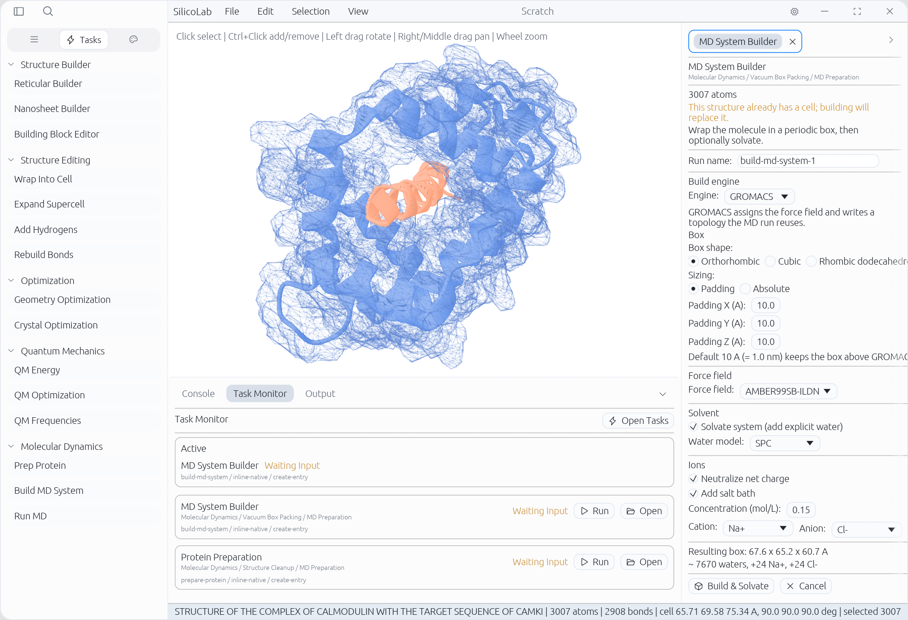

<p align="left">
  
  &nbsp;&nbsp;
  <picture>
    <source media="(prefers-color-scheme: dark)" srcset="assets/brand/wordmark-dark.svg">
    
  </picture>
</p>

<p align="left"><em>Computational environment for chemistry, biology &amp; materials research.</em></p>



## Features

- Interactive 3D visualization and editing of molecular and crystal structures
- 2D molecule sketcher — draw a molecule (atoms, bonds, ring/fragment templates,
  charges) on a canvas and build it into a real 3D structure; also import/export
  SMILES, with a scriptable `sketch <SMILES>` command in the console and CLI
- Force-field geometry optimization
- Quantum chemistry calculations
- Guided molecular dynamics setup and execution (powered by GROMACS)
- Reticular structure builder — assemble COFs and MOFs from building blocks
- One scripting language for everything: the same scripts run in the GUI
  console and headless on the CLI, making workflows easy to automate and
  agent-friendly

## Installation

### Prebuilt Executables

Prebuilt executables can be downloaded from GitHub Releases.

### Build from Source

Install the Rust toolchain, then build the release executable:

```sh
cargo build --release
```

The built binary is written to `target/release/` (`silicolab` on Linux/macOS,
`silicolab.exe` on Windows).

## Usage

Run with no arguments to launch the GUI:

```sh
silicolab
```

Pass a script path to run it headless from the command line:

```sh
silicolab workflow.sls
```

The same scripts also run interactively in the GUI console. Scripting
documentation is in progress.

## External Dependencies

### GROMACS (required for molecular dynamics)

Molecular dynamics simulations require [GROMACS](https://www.gromacs.org/) to be installed separately.
GPU acceleration is **strongly recommended** — running MD on CPU alone is technically possible but prohibitively slow for any non-trivial system.

- **Windows:** Install GROMACS inside [WSL](https://learn.microsoft.com/en-us/windows/wsl/install) (`sudo apt install gromacs`). For GPU support, compile from source with CUDA inside WSL.
- **Linux:** `sudo apt install gromacs` for a quick start; compile from source with CUDA/ROCm for GPU acceleration.
- **macOS:** `brew install gromacs`. Note that GPU acceleration is not supported on Apple hardware, so MD performance will be limited.

### Remote execution over SSH (optional)

Heavy MD can be offloaded to a remote machine (an HPC login node, a GPU box) while
the GUI stays on your laptop. SilicoLab drives the OS OpenSSH client (`ssh`/`scp`)
as subprocesses — no extra dependency to install (the OpenSSH client ships with
macOS/Linux and is an on-by-default optional feature on Windows 11; enable it under
*Settings → Apps → Optional features → OpenSSH Client* if it is missing).

**Set up a host** in *Settings → Engines → Remote Hosts*:

1. **Add host** — give it a label, hostname/IP, username, and (optionally) a port
   and a remote work directory (defaults to `~/.silicolab`). Under *Setup commands*
   put whatever a fresh, non-interactive SSH shell needs to make `gmx` runnable —
   e.g. `module load gromacs` or `source /opt/gromacs/bin/GMXRC` — one per line.
2. **Set up passwordless login** — SilicoLab generates a dedicated key
   (`~/.silicolab/keys/id_silicolab_ed25519`, never your own keys) and shows a
   one-line command to run once on the host (paste it into a terminal, or type
   `! <command>` in the SilicoLab prompt). Click **Verify** to confirm. Passwordless
   (key-based) login is required so unattended jobs never block on a password.
3. **Detect GROMACS** — probes the host for `gmx` and records its version.

**Run remotely:** in the Run MD or Build MD System panel, set **Compute** to your
host. SilicoLab stages the inputs up, launches each `gmx` step detached so a dropped
connection can't kill it, streams the live log back, and stages results down — the
result (structure, energies, trajectory) appears exactly as for a local run. Press
**Esc** to cancel (it kills the remote job too).

v1 limitations: a remote run occupies the single engine-job slot while active;
closing the app leaves an in-flight remote job running (a `remote_run.json` record
is written into the local run directory) but does not auto-reattach to it; remote
scratch directories under `<work_root>/runs/<run-id>` are not garbage-collected
automatically.

## License

Licensed under either of [Apache-2.0](LICENSE-APACHE) or [MIT](LICENSE-MIT) at
your option.

Unless you explicitly state otherwise, any contribution intentionally submitted
for inclusion in this work by you, as defined in the Apache-2.0 license, shall be
dual licensed as above, without any additional terms or conditions.
